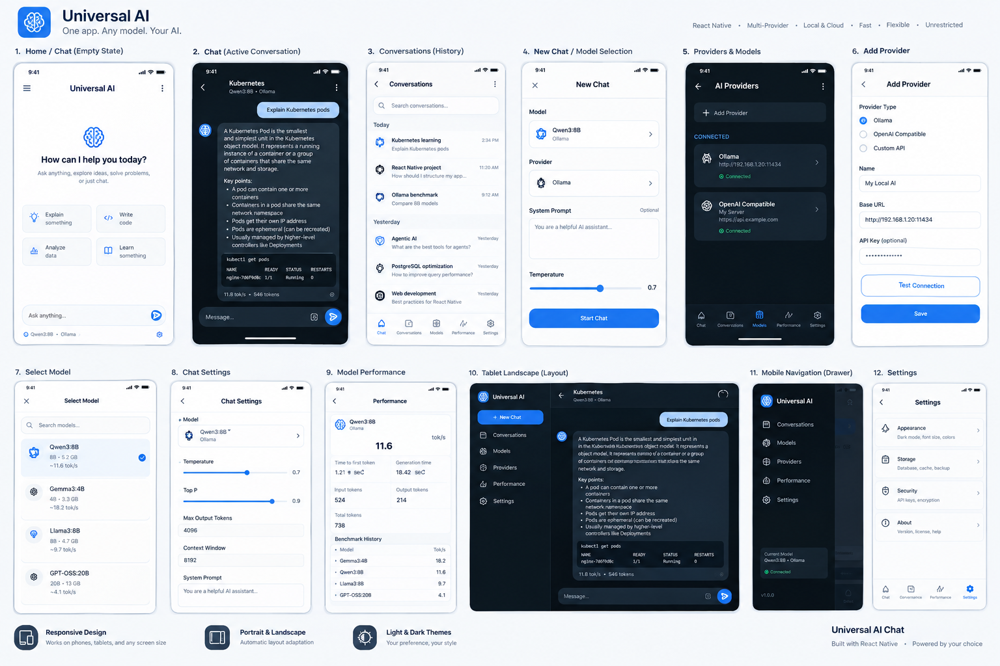

# Universal AI Chat 🚀

<p align="center">
  
</p>

<p align="center">
  <strong>A modern, privacy-first, cross-platform AI chat workstation built for local LLMs and cloud intelligence.</strong>
</p>

<p align="center">
  <a href="#-key-features"></a>
  <a href="#-tech-stack"></a>
  <a href="#-tech-stack"></a>
  <a href="#-license"></a>
  <a href="#-local-first--privacy"></a>
</p>

---

## 📖 Overview

**Universal AI Chat** is a developer-grade, privacy-centric AI interface designed to bridge local LLM execution environments (**Ollama**, **LM Studio**, **vLLM**, **llama.cpp**, **LocalAI**) and cloud providers (**OpenAI**, **OpenRouter**, **Groq**, **Together**, **Custom Endpoints**) under a single unified experience.

Built from the ground up for high responsiveness and fluid multi-device adaptation, it offers 60+ FPS adaptive master-detail layouts on tablets/desktops, compact slide-out mobile drawers, real-time token telemetry dashboards, and per-chat context controls.

---

## 🌟 Key Features

### 🔌 Multi-Provider & Model Agnostic
- **Local AI Engines**: Direct native connection to local instances (`http://localhost:11434`, `http://192.168.x.x:11434`, or LAN endpoints).
- **OpenAI-Compatible APIs**: Plug in vLLM, LM Studio, LiteLLM, Groq, OpenRouter, Together AI, or your private enterprise proxies with custom base URLs and headers.
- **Dynamic Model Auto-Discovery**: Automatic fetching of available models from Ollama and OpenAI-compatible `/v1/models` endpoints.
- **Independent Model Presets**: Per-conversation model selection with individual parameter overrides (Temperature, Top-P, Context Window, Max Tokens, Custom System Prompts).

### 🖥️ Adaptive & Draggable Workspace
- **Fluid Multi-Device Layouts**:
  - 📱 **Mobile (< 600px)**: Compact single-pane layout with bottom tab bar, slide-out drawer, and full-screen conversation view.
  - 📱 **Mobile Landscape (< 768px)**: Optimized full-width screen preventing cramped horizontal views.
  - 🖥️ **Tablet & Desktop (≥ 768px)**: Adaptive dual-pane workspace with live resizable master-detail sidebar.
- **Draggable & Stretchable Sidebar**:
  - Smooth 60+ FPS unthrottled dragging (`220px` to `520px`).
  - One-click snap into a **`60px` Minimal Icon Rail** for maximum chat surface area.
  - Remembers your custom stretched width when collapsing and re-expanding.
- **Unified Controls**: Consolidated footer docking Settings and Dark/Light theme toggles.

### ⚡ Live Generation Telemetry & Performance
- **Real-Time Speed Measurement**: Live generation speed in `tokens/sec` with status indicators.
- **Time to First Token (TTFT)**: Precise latency measurement from request dispatch to the initial token stream.
- **Telemetry & Benchmark Dashboard**: Track historical generation speeds, token consumption, context usage, and compare model throughput across Qwen, Llama, DeepSeek, Gemma, and Mistral.

### 💬 Rich Chat Experience
- **Markdown & Syntax Highlighting**: Full Markdown parsing with code blocks, language badges, and one-tap **Copy Code**.
- **Message Branching & Editing**: Rewind, edit previous prompts, resend, or clear chat history non-destructively.
- **Context Window Protection**: Automatic context estimation and pair-preserving sliding window pruning to avoid out-of-memory crashes on local CPU/GPU setups.
- **Zero Lock-In Storage**: Universal storage engine with full export and offline capability.

---

## 🛠️ Tech Stack

| Layer | Technology |
| :--- | :--- |
| **Framework** | [React Native](https://reactnative.dev/) / [Expo SDK 54](https://expo.dev/) |
| **Language** | [TypeScript 5](https://www.typescriptlang.org/) (Strict Mode) |
| **State Management** | [Zustand](https://github.com/pmndrs/zustand) (Modular persistent stores) |
| **Icons** | [Lucide Icons](https://lucide.dev/) (`lucide-react-native`) |
| **Styling & Design** | Pure tokenized design system (Light/Dark themes, high contrast, responsive breakpoints) |
| **Testing & Runner** | [Bun Test](https://bun.sh/) (60+ unit, integration, and E2E simulation tests) |

---

## 🚀 Quick Start

### Prerequisites
- [Node.js](https://nodejs.org/) (v18+) or [Bun](https://bun.sh/)
- [Expo CLI](https://docs.expo.dev/get-started/installation/) (`npx expo`)
- (Optional) [Ollama](https://ollama.com/) or [LM Studio](https://lmstudio.ai/) running locally.

### 1. Clone the Repository
```bash
git clone https://github.com/your-org/universal-ai-chat.git
cd universal-ai-chat
```

### 2. Install Dependencies
```bash
# Using Bun (Recommended)
bun install

# Or using npm
npm install
```

### 3. Start the Development Server
```bash
# Start Metro bundler
npx expo start

# Run directly in web browser
npm run web

# Run on Android device / emulator
npm run android

# Run on iOS simulator (macOS required)
npm run ios
```

---

## 🔌 Provider Setup Guides

### Connecting to Local Ollama
1. Start Ollama with network binding enabled (for Wi-Fi / Android testing):
   ```bash
   OLLAMA_HOST=0.0.0.0:11434 ollama serve
   ```
2. Pull your desired models:
   ```bash
   ollama pull qwen2.5:7b
   ollama pull llama3.2:3b
   ollama pull deepseek-r1:8b
   ```
3. In Universal AI Chat:
   - Open **Models & Providers** -> click **+ Add Provider**.
   - Select **Ollama**.
   - Enter your host:
     - Web / Desktop: `http://localhost:11434`
     - Android Device over Wi-Fi: `http://192.168.1.xxx:11434`
     - Android Emulator: `http://10.0.2.2:11434`
   - Click **Test Connection** -> **Save Provider**.

### Connecting to LM Studio / vLLM / LiteLLM
1. Start local server in LM Studio (default port `1234`) or vLLM (`8000`).
2. In Universal AI Chat:
   - Select **OpenAI Compatible**.
   - Base URL: `http://localhost:1234/v1` (or `http://localhost:8000/v1`).
   - Click **Fetch Models** and save.

### Connecting to Cloud Providers (OpenAI, OpenRouter, Groq)
1. Add a new **OpenAI Compatible** provider.
2. Provide the Base URL and API Key:
   - **OpenRouter**: `https://openrouter.ai/api/v1`
   - **Groq**: `https://api.groq.com/openai/v1`
   - **OpenAI**: `https://api.openai.com/v1`
3. Hit **Fetch Models** to automatically populate available remote models.

---

## 📁 Repository Structure

```
.
├── src/
│   ├── components/
│   │   ├── chat/             # MessageBubble, ChatInputBar, EmptyChatState, SuggestionCards
│   │   ├── common/           # Header, Tooltip, DropdownMenu, Button, Badges
│   │   ├── navigation/       # TabletSidebar, MobileDrawer, BottomTabBar
│   │   └── modals/           # ModelSelectorModal, ChatSettingsModal, AddProviderModal
│   ├── constants/            # Layout, breakpoints, default models & system parameters
│   ├── hooks/                # useResponsive, useKeyboard, useTheme hooks
│   ├── providers/            # AIProvider interface, OllamaProvider, OpenAICompatibleProvider
│   ├── screens/              # ChatScreen, ConversationsScreen, ProvidersScreen, PerformanceScreen
│   ├── services/             # ContextManager, TokenCalculator, TitleGenerator, Benchmarks
│   ├── storage/              # Universal storage drivers (Memory, WebStorage, NativeAsync)
│   ├── store/                # Zustand stores (appStore, chatStore)
│   ├── theme/                # Design tokens, color palettes, dark/light definitions
│   └── types/                # Strict TypeScript interfaces & schemas
├── tests/                    # E2E simulations, store flows, token calculators & driver tests
├── App.tsx                   # Main responsive application entry
├── app.json                  # Expo application configuration
├── package.json              # Dependencies and scripts
└── tsconfig.json             # TypeScript compiler configuration
```

---

## 🧪 Testing & Validation

Universal AI Chat includes a suite of automated tests covering stores, streaming pipelines, context management, and persistence drivers:

```bash
# Run all unit and integration tests
bun test

# Type-check TypeScript codebase
node --stack-size=8192 ./node_modules/typescript/bin/tsc --noEmit
```

---

## 🤝 Contributing

Contributions, feature proposals, and bug reports are welcome!

1. **Fork the repository**
2. **Create a feature branch**:
   ```bash
   git checkout -b feature/amazing-feature
   ```
3. **Commit your changes**:
   ```bash
   git commit -m "feat: add amazing feature"
   ```
4. **Push to the branch**:
   ```bash
   git push origin feature/amazing-feature
   ```
5. **Open a Pull Request**

Please ensure all tests pass (`bun test`) before submitting pull requests.

---

## 📄 License

This project is licensed under the **MIT License** - see the [LICENSE](LICENSE) file for details.
